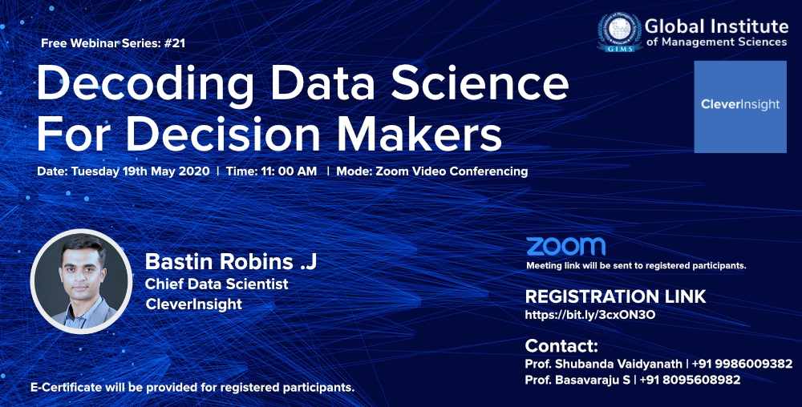

The webinar was organized on 19th May 2020, collaborated with Global Institute Of Management Studies, Bangalore. We had a amazing response from the audiences, the topics which was discussed were like

- What is data science
- How Machine learning can help
- Three usecases for a Ecommerce industry.
- Usecases and discussions. 

